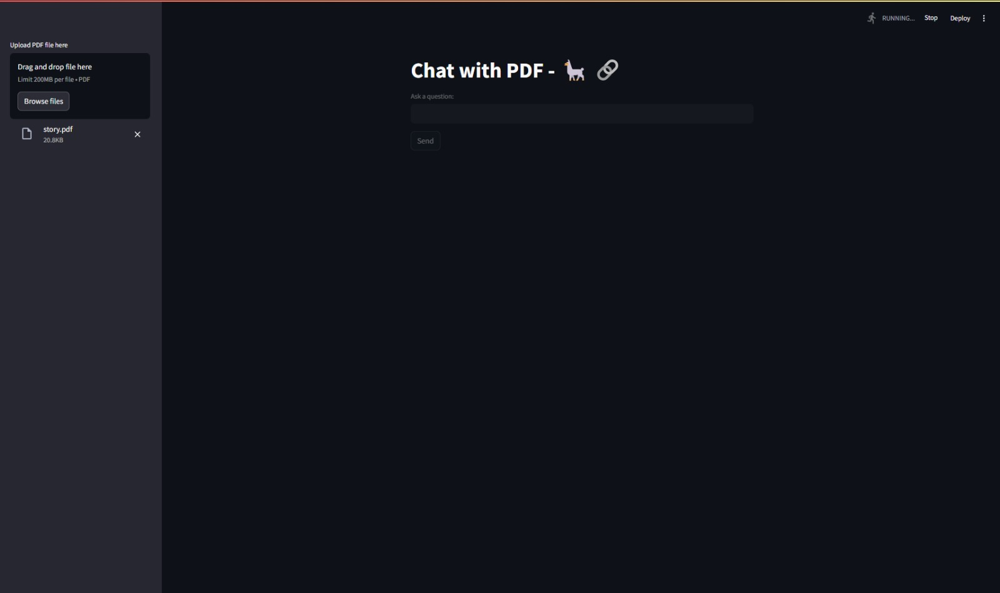
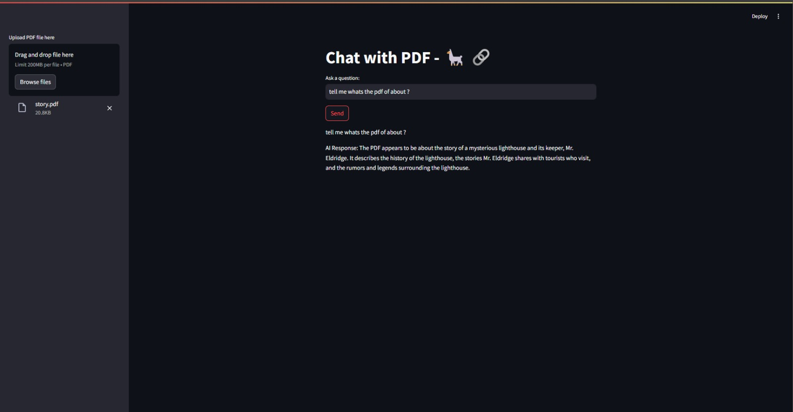
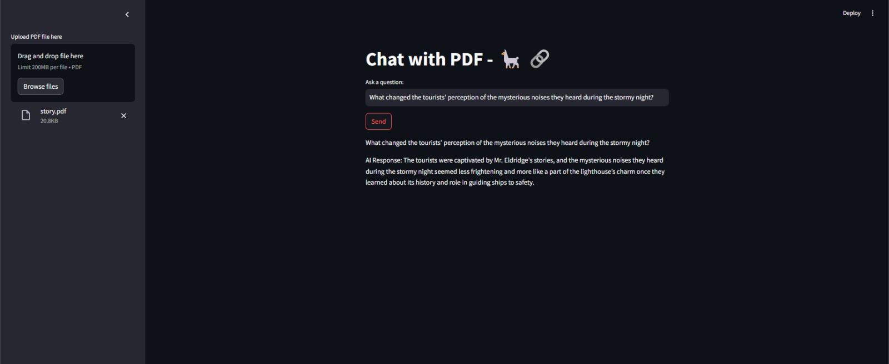
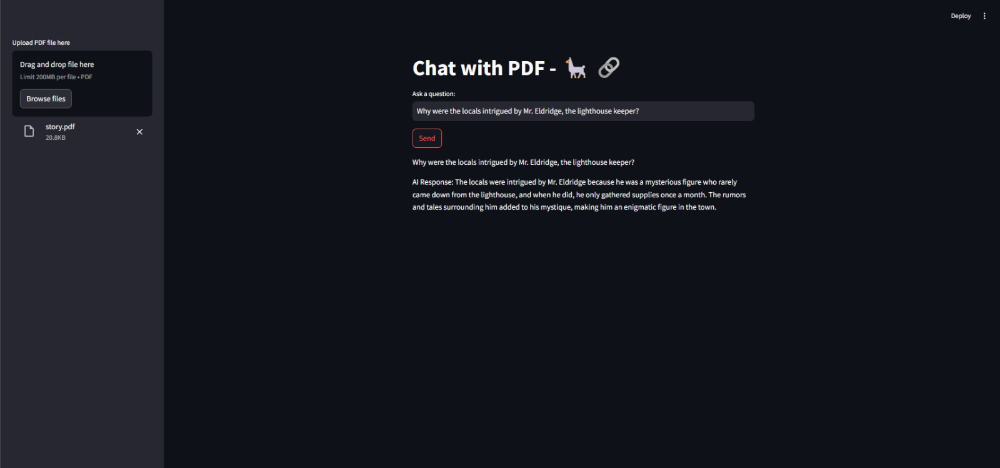

# Chat with PDF -

Interact with your PDFs using natural language queries powered by **LLaMA 2 (7B) Chat GGUF** and a custom-built Streamlit interface. This application enables users to upload PDFs and ask questions, receiving intelligent answers generated from the PDF content.

---

## Features
- Upload PDF and parse its contents
- Query the document using natural language
- Get context-aware AI responses
- Powered by `llama-2-7b-chat.Q4_K_M.gguf` from HuggingFace
- Streamlit-based UI for simplicity and elegance

---

## Directory Structure
```
Chat with PDF - Conversational AI model/
├── Code/
│   ├── app.py               # Streamlit frontend
│   ├── conversational.py    # Handles LLM querying
│   ├── fileingestor.py      # PDF loader & chunker
│   ├── loadllm.py           # LLM loader
│   └── requirements.txt     # Dependencies
├── Test_Sample/
│   ├── story.pdf
│   └── story_2.pdf
├── Results/
│   ├── IMG-20250323-WA0002.jpg
│   ├── IMG-20250323-WA0003.jpg
│   ├── IMG-20250323-WA0004.jpg
│   └── IMG-20250323-WA0005.jpg
```

---

## Setup Instructions

### 1. Clone the Repository

git clone https://github.com/yourusername/chat-with-pdf-llama.git
cd chat-with-pdf-llama


### 2. Create Virtual Environment & Install Dependencies

python -m venv venv
source venv/bin/activate  # On Windows: venv\Scripts\activate
pip install -r Code/requirements.txt


### 3. Download the Model
Download the LLaMA 2 7B model from Hugging Face:
- [llama-2-7b-chat.Q4_K_M.gguf](https://huggingface.co/TheBloke/Llama-2-7B-Chat-GGUF/blob/main/llama-2-7b-chat.Q4_K_M.gguf)

Place the file in a folder named `models/` inside the root project directory:

chat-with-pdf-llama/
└── models/
    └── llama-2-7b-chat.Q4_K_M.gguf


---

## Running the App
From the root directory, run:
```bash
streamlit run Code/app.py
```

The app will launch in your browser. You can:
- Upload a PDF (e.g., `story.pdf`)
- Ask questions like:
  - "What is the PDF about?"
  - "Why were the locals intrigued by the lighthouse keeper?"

---

## Screenshots

### Upload Interface


### First Query Response


### Deeper Follow-Up


### Further Insight


---

## Results
The app reads and chunks the uploaded PDF, and intelligently matches the user’s query against relevant parts using embeddings. It then forwards the chunked context to the LLM and renders the response.

---

## Model Info
- **Model**: LLaMA 2 7B Chat
- **Quantization**: Q4_K_M GGUF
- **Source**: [HuggingFace](https://huggingface.co/TheBloke/Llama-2-7B-Chat-GGUF)

---

## Future Enhancements
- Add support for multiple PDFs
- Enable OCR for scanned PDFs
- Allow saving chat history
- Add feedback loop for model improvement

---
